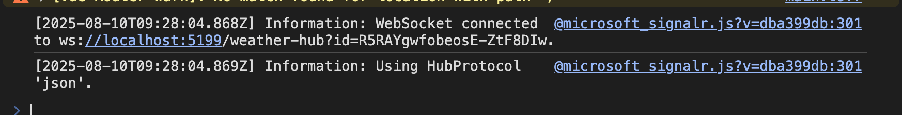
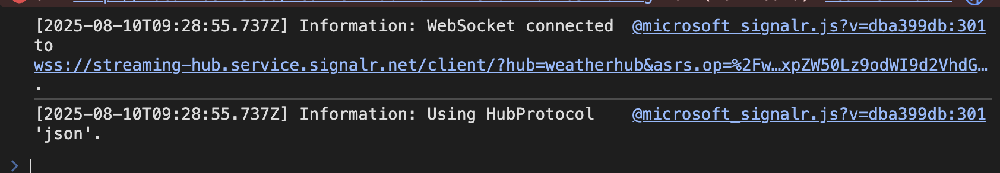

# 🚀 Building Real-Time Apps with SignalR in .NET

Hi everyone! 👋
I’ve just released a new article showing how to create real-time applications like collaboration tools, flight data dashboards, GPS tracking and more using **SignalR**.

SignalR is an open-source library from Microsoft that lets you build real-time apps in about 30 lines of code (assuming you already have an existing codebase).

In today’s world, real-time data is something users simply expect. That’s why I wrote this article: to give .NET developers a straightforward introduction to implementing real-time functionality within the ecosystem.

## What We’ll Discuss

* The underlying web principles SignalR abstracts: WebSockets, Server-Sent Events (SSE), and Long Polling
* How to implement SignalR in an existing .NET Core application
* How to scale using Azure SignalR Service

To help you get started quickly, the repo contains a working example of the app discussed here. You’ll find everything needed to run the app both locally and with Azure SignalR Service.


---

## Before the Age of Real-Time Apps

Before real-time apps existed, this is how apps handled data updates:

* Users had to manually refresh pages a lot (hitting F5 repeatedly)


* Or developers set up automatic page refresh using a meta tag in the HTML head, like this:

```html
<meta http-equiv="refresh" content="5" />
```

While clever for the time, these methods are inefficient and provide poor user experience.

## Underlying Technologies SignalR Uses

Even though SignalR takes away a lot of the complexity, it’s still good to have a basic idea of what happens at the network level so you actually know what’s going on.

For sending real-time information, SignalR uses the following techniques, ranked from worst to best:

### 1. Long Polling

The client opens a connection to the server, which holds it open until new data is available. Once the server responds, the client reconnects and waits again.


### 2. Server-Sent Events (SSE)

The client opens a single connection that the server keeps open, allowing the server to send multiple messages over time. Note SSE is one-way - from server to client only.


### 3. WebSockets

The client requests to upgrade the HTTP connection to a WebSocket. After acceptance, this persistent, full-duplex connection lets client and server send messages to each other anytime.


SignalR tries WebSockets first, then SSE, and falls back to Long Polling if needed ([Docs](https://learn.microsoft.com/nl-nl/aspnet/core/signalr/introduction?view=aspnetcore-9.0&WT.mc_id=dotnet-35129-website#transports)).

## Solution Design Overview

Here’s the high-level architecture of the demo app:

* **IoT Devices:** Simulated via a console app, sending data to a Web API using HttpClient
* **Web API:** Receives device data, pushes it to a SignalR Hub
* **SignalR Hub:** Broadcasts updates to connected clients
* **JavaScript Client:** A Vue.js app that connects to the hub and receives real-time updates


## Backend (Web API) Setup

### 1. Scaffold the Web API project

If you don’t have a project yet, create one with:

```bash
dotnet new webapi -o WebApi
```

### 2. Add SignalR services in `Program.cs`

```csharp
builder.Services.AddSignalR();
```

No additional package install is needed since SignalR ships with ASP.NET Core.

### 3. Create the Hub class

Create a `Hubs` folder and inside it add `WeatherHub.cs`:

```csharp
using Microsoft.AspNetCore.SignalR;

namespace WebApi.Hubs
{
    public sealed class WeatherHub : Hub { }
}
```

### 4. Map the hub endpoint in `Program.cs`

```csharp
app.MapHub<WeatherHub>("/weather-hub");
```

This endpoint allows clients to establish a SignalR connection.

### 5. Define the WeatherData record

```csharp
public record WeatherData(string DeviceId, int Temperature, int Humidity);
```

### 6. Add the HTTP POST endpoint to receive data and send to clients

```csharp
app.MapPost("/weather-reading", async (
    [FromBody] WeatherData data,
    IHubContext<WeatherHub> hubContext) =>
{
    // Send data to all connected clients listening for the "WeatherDataProcessed" event
    await hubContext.Clients.All.SendAsync("WeatherDataProcessed", data);
    Console.WriteLine($"Data Received {data}");
    return Results.StatusCode(StatusCodes.Status201Created);
})
.WithName("PostWeatherReading");
```

_Note: this is the most basic implementation possible. You could for example, abstract away all hub related actions into a service, with strongly defined types etc. Want to read more on this, go to: [Strongly Typed Hubs](https://learn.microsoft.com/nl-nl/aspnet/core/signalr/hubs?view=aspnetcore-9.0#strongly-typed-hubs).

_Also note that I have left out authentication & authorization as this would just blow up the article. For more on this please read the [documentation](https://learn.microsoft.com/en-us/aspnet/core/signalr/authn-and-authz?view=aspnetcore-9.0)._

### 7. Update CORS settings to allow cross-origin requests (for demo purposes)

```csharp
builder.Services.AddCors();

app.UseCors(p => p
    .SetIsOriginAllowed(_ => true)
    .AllowAnyHeader()
    .AllowAnyMethod()
    .AllowCredentials());
```

> ⚠️ Don’t use this open CORS policy in production.

## Frontend (Vue.js Client)

### 1. Scaffold a new Vue.js project

You can use:

```bash
pnpm create vue@latest
```

Follow the prompts.

### 2. Install SignalR client SDK

```bash
pnpm install @microsoft/signalr
```

### 3. Setup the SignalR connection inside your main component (e.g. `App.vue`)

```javascript
import { HubConnectionBuilder, LogLevel } from '@microsoft/signalr'

type WeatherData = {
    deviceId: string
    temperature: number
    humidity: number
    timestamp: Date
}

const readings = ref<WeatherData[]>([])

const apiBaseUrl = 'http://localhost:5199' // Replace with your backend URL

const connection = new HubConnectionBuilder()
    .withUrl(`${apiBaseUrl}/weather-hub`)
    .configureLogging(LogLevel.Information)
    .build()

async function start() {
    try {
        await connection.start()
        connection.on('WeatherDataProcessed', (payload: WeatherData) => {
            if (!payload.timestamp) payload.timestamp = new Date()
            readings.value.push(payload)
        })
    } catch (err) {
        console.log(err)
        setTimeout(start, 5000)
    }
}

connection.onclose(async () => {
    await start()
})

start()
```

The client connects to the SignalR hub, listens for `WeatherDataProcessed` messages, and updates its local state accordingly.

## IoT Devices Simulator

To simulate devices sending data to the API, I recommend checking the GitHub repo where the full code is available. The device simulator is a simple console app using `HttpClient` to POST weather data.

## Scaling Challenges & Solutions


When scaling to multiple server instances, each instance runs its own SignalR context. This means clients connected to different servers won't receive all updates.

### How to fix this: Azure SignalR Service


Azure SignalR Service centralizes all SignalR traffic, so all server instances push messages to a shared hub managed by Azure.

From the client and IoT device perspective nothing really changes. What’s new is the SignalR service hosted in Azure. Almost everything in the app stays the same. What we do need is the connection string of the Azure SignalR Service. When we want to send a message to the connected clients, we forward it to the service which then in return notifies the clients.

Important to also understand here is that the client gets the notifications through a client endpoint. The client receives this endpoint when calling the `/hub` endpoint on the ASP.NET Core Web API.

## Applying Azure SignalR Service to the app

### 1. Create an Azure SignalR Service in the Azure portal

### 2. Add Azure SignalR NuGet package

```bash
dotnet add package Microsoft.Azure.SignalR
```

### 3. Change the service registration in `Program.cs` to

```csharp
builder.Services.AddSignalR().AddAzureSignalR();
```

### 4. Add your connection string

You can pass the connection string inline or via configuration. For demo, inline example:

```csharp
builder.Services.AddSignalR().AddAzureSignalR("<your-azure-signalr-connection-string>");
```

> If no connection string is passed, it will use the default config key: `Azure:SignalR:ConnectionString` [Docs](https://learn.microsoft.com/en-us/azure/azure-signalr/signalr-quickstart-dotnet-core).

### 5. Run Your App

Once configured, your clients will connect through the Azure SignalR Service seamlessly—there’s no difference in how they interact with your app.

---

### Connection Behavior: Local vs Azure SignalR

When inspecting the WebSocket connection on the client side, you’ll notice different endpoints depending on your setup:

* **Local setup:** The client connects directly to your local SignalR hub endpoint.

  

* **Azure SignalR Service:** The client connection is redirected to the Azure SignalR Service endpoint, which manages the real-time messaging at scale.

  

*This redirection to the Azure SignalR hub endpoint aligns with the architecture diagram and demonstrates how Azure manages connections behind the scenes.*

---

## Summary

SignalR is a powerful and simple way to add real-time features to your .NET apps. It automatically picks the best available transport protocol. Azure SignalR Service helps you scale without complex infrastructure work.

Real-time apps are expected by users today. SignalR is one of the fastest ways to build them in the .NET ecosystem.

---

*Feel free to reach out if you want to see the full source code or have questions!*

## Resources Used

* [https://learn.microsoft.com/en-us/azure/azure-signalr/signalr-quickstart-dotnet-core](https://learn.microsoft.com/en-us/azure/azure-signalr/signalr-quickstart-dotnet-core)
* [https://learn.microsoft.com/nl-nl/aspnet/core/tutorials/signalr-typescript-webpack?view=aspnetcore-9.0\&tabs=visual-studio](https://learn.microsoft.com/nl-nl/aspnet/core/tutorials/signalr-typescript-webpack?view=aspnetcore-9.0&tabs=visual-studio)
